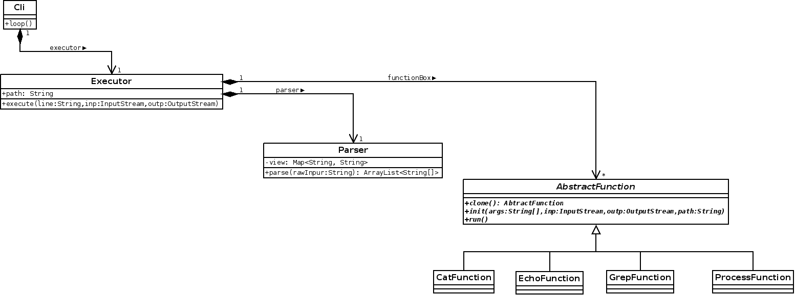

## Command Line Interpreter

### Описание
Интерпретатор командной строки bash. Реализованные функции:
* cat [FILENAME]
* echo
* exit
* cd

Не реализованные функции вызываются из системных директорий. Поддерживает интеративный режим работы.

Поддерживает кавычки \' и \" и подстановку в **$var**, а также pipelining с помощью оператора **|**
(работает параллельно, все создания переменных в пайпах игнорируются, так как эмулируется вызов subshell)

### Структура проекта
**Cli** класс - основной. Имеет метод `loop()` для запуска работы шелла.
Не возвращается - возврат только командой exit. Последовательно считывает строки и отправляет их на выполнение объекту класса **Executor**.

**Parser** - клас, позволяет преобразовать строку с командой к массиву аргументов,
выполняет подстановку. Имеет единственный метод `parse()`, выполняющий нужные действия.

Все невстроенные команды наследуются от **AbstractFunction**, который задает интерфейс создания и исполнения команды.

Классы, которые наследуются от **AbstractFunction**:
* **CatFunction** - реализация аналога комманды в cat в unix
* **EchoFunction** - реализация аналога комманды в echo в unix
* **ProcessFunction** - вызов сторонней программы, использует ProcessBuilder

Встроенные функции, такие как `exit` и `cd` обрабатываются на уровне класса **Executor**.

### Диаграмма классов

